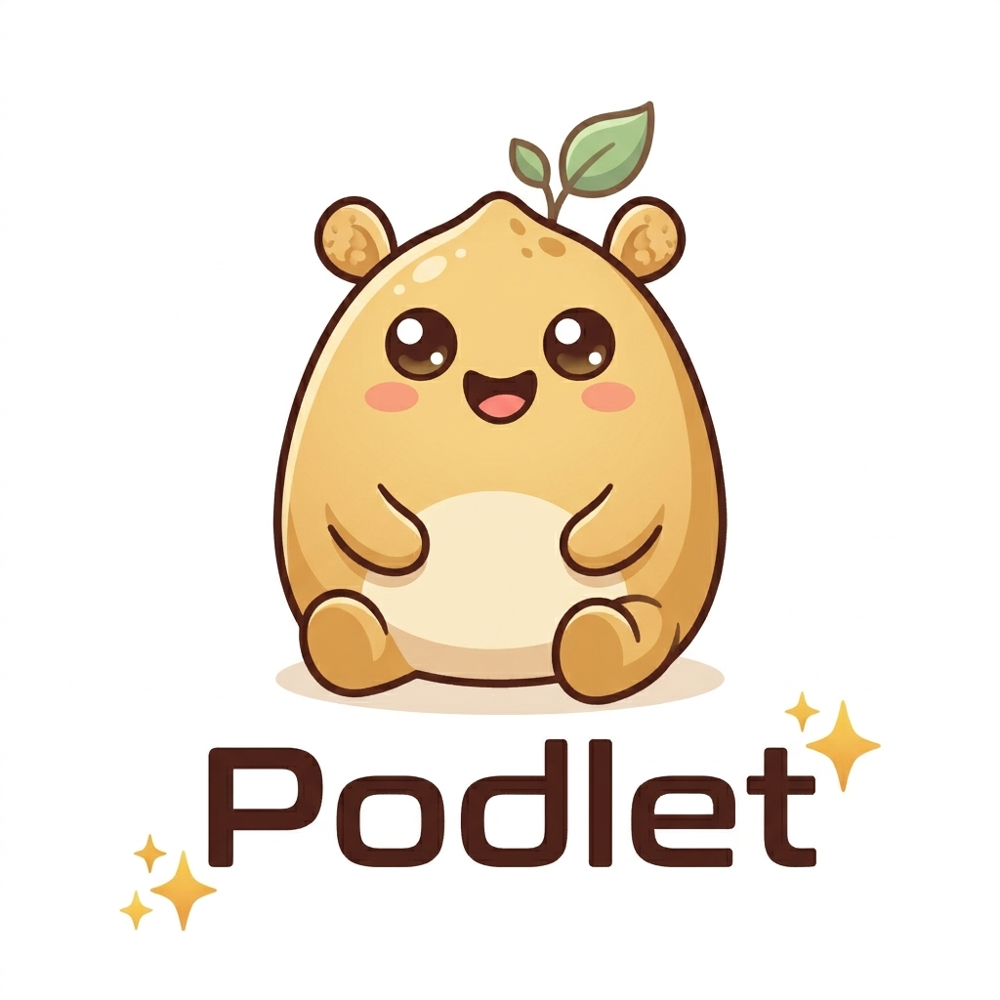

# Podlet

**Modular AI Agent Orchestration System**

[](LICENSE)

## What is Podlet?

Podlet is a **free and open source** modular AI chat app.

## Quick Start

### Docker (Recommended)

Docker version offer a better safety because it runs in a separate and contained environment , only the .podlet folder is shared with the agents.
In case of a prompt injection in a web page or something similar in a skill or mcp, this will add an additional layer of protection .

There are some downsides that will make your agents more limited because of the limitations of the container and what is installed on it.
So some mcps won't work , your system env variables won't be forwarded to the container, websearches will be more flagged as robot and likely trigger captchat and thus be rejected.

But for most usecases it is sufficient while offering a superior safety layer.

<span style="color:blue">Prerequisites: Docker and Docker Compose</span>

```bash
curl -fsSL https://raw.githubusercontent.com/HellKaiser45/Podlet/main/install.sh -o /tmp/p.sh; bash /tmp/p.sh
# Choose option 1 (Docker)
```

This command will setup the container and the .podlet directory in your home folder. You'll need to check the config and add your models and api keys in .envs.

After that you can go in the Podlet/ folder and run:

`docker compose up -d`

Or manually:

```bash
git clone https://github.com/HellKaiser45/Podlet.git
cd Podlet
docker compose build
```

Then edit the config, models and .env in the .podlet directory in your home folder.

Once the container is running it will be accessible from your network over:

<http://localhost:3000> on the same machine or <http://ip-address:3000>

### Native Installation

This should be use only if you need the agent to use your machine system or perform commands directly on your host system. Or if you want an agent to use commands, mcps or skills that require a specific package installed on the system and thus won't work on the docker version.

While there are several mecanisms to prevent prompt injections attacks, be aware that the risk of data leaks is much higher than the docker version.

Prerequisites: Bun 1.0+ and Python 3.12+ and Python venv

```bash
curl -fsSL https://raw.githubusercontent.com/HellKaiser45/Podlet/main/install.sh | bash
# Choose option 2 (Native)
```

Or manually:

```bash
git clone https://github.com/HellKaiser45/Podlet.git
cd Podlet
bun install
bun run init
```

After that you'll have to check the config, add your models and api keys inside the .podlet folder (config.json, models.json and .env) then you can start the server (dev only for now) with:
`bun run start`

## Docker Configuration

All configuration lives in a single `config.json` file inside the Docker volume.

### Volume Management

All data persists in a Docker named volume:

```bash
# Inspect volume
docker volume inspect podlet_podlet-data

# Reset (WARNING: deletes all data)
docker compose down -v
```

### MCP Servers

The gateway container includes `npx` (Node.js 20) and `uvx` (Python + uv) for running MCP tool servers in the gateway container directly. Configure MCP servers by editing `mcp.json` in the volume (`.podlet/` folder ).

### Updating

```bash
git pull
docker compose build --pull
docker compose up -d
```

### Logs

```bash
docker compose logs -f gateway
docker compose logs -f agent-core
```

## Architecture

```text
       [ User Interface ] <------> [ Gateway (Elysia/Bun) ] <------> [ Python Backend (FastAPI) ]
       (SolidJS / Web)             (Orchestrator & API)              (LiteLLM / Streaming)
                                            |                                  |
                                            v                                  v
                                    [ Virtual FS ]                      [ LLM Providers ]
                                    (Workspace/Artifacts)               (OpenRouter, OpenAI, 
                                                                        Ollama, Gemini, etc.)
                                            |
                                            +------> [ MCP Servers ]
                                                     (Search, Context, etc.)
```

## Configuration

Podlet uses a dedicated configuration directory located at `~/.podlet/` .

| File | Description |
| :--- | :--- |
| `config.json` | Global server settings. See full schema below. |
| `models.json` | LLM definitions including provider, model ID, API key reference, and temperature. |
| `mcp.json` | Configuration for MCP servers (commands, arguments, and environment variables). |
| `.env` | Environment variables for API keys (e.g., `OPENROUTER_API_KEY`). |
| `agents/*.json` | Individual agent definitions and capabilities. |
| `prompts/*.md` | System prompts for agents. |
| `skills/` | Directories containing skill modules (documented in `SKILL.md`). |

### config.json Schema

⚠️ Ports config must not be changed if you use the Docker version.
If you want to change the exposed port (change port 3000 to something else) you must edit the `compose.yml` file.

```json
{
  "server": {
    "port": 3000,
    "host": "127.0.0.1",
    "pythonPort": 8000,
    "webPort": 3002,
    "exposedPort": 3002
  },
  "database": {
    "path": "podlet.db"
  },
  "logging": {
    "level": "info"
  },
  "features": {
    "safemode": true,
    "max_concurrent_agents": 5,
    "cors_origin": "http://localhost:3002"
  },
  "docker": {
    "enabled": false,
    "llmServiceHost": "localhost",
    "staticFrontend": false
  }
}
```

| Field | Type | Default | Description |
| :--- | :--- | :--- | :--- |
| `server.port` | number | `3000` | Gateway API port. |
| `server.host` | string | `"127.0.0.1"` | Bind address (`0.0.0.0` in Docker). |
| `server.pythonPort` | number | `8000` | Port for the internal Python LLM backend. |
| `server.webPort` | number | `3002` | Port for the SolidJS web frontend. |
| `server.exposedPort` | number | same as `port` | Port visible to user. |
| `database.path` | string | `"podlet.db"` | SQLite database file path. |
| `logging.level` | string | `"info"` | Log verbosity (`debug`, `info`, `warn`, `error`). |
| `features.safemode` | boolean | `true` | Enable Human-in-the-Loop (HIL) approval for destructive tools. |
| `features.max_concurrent_agents` | number | `5` | Maximum number of simultaneous agent runs. |
| `features.cors_origin` | string | `"http://localhost:3002"` | Allowed CORS origin for the frontend. |
| `docker.enabled` | boolean | `false` | Docker mode flag. |
| `docker.llmServiceHost` | string | `"localhost"` | Python service hostname. |
| `docker.staticFrontend` | boolean | `false` | Gateway serves frontend. |

## Agents

Agents are the core units of Podlet. They are defined in `~/.podlet/agents/*.json`.

### Agent Schema

```json
{
  "agentId": "string",(basically the name of the agent, it does not allow spaces and other special characters or maj)
  "agentDescription": "string",
  "model": "string (key from models.json)",
  "system_prompt": "string (filename in prompts/)",
  "mcps": ["mcpId1", "mcpId2"],
  "skills": ["skill-name1", "skill-name2"],
  "subAgents": ["agentId1", "agentId2"]
}
```

## Tools System

Agents have access to three categories of tools:

1. **Core Tools**: Built-in capabilities like `read_file` and `execute_shell`.
2. **MCP Tools**: Tools provided by MCP servers defined in `mcp.json` (e.g., `ddg-search_search`).
3. **Sub-agent Tools**: Other agents can be called as tools (sub-agents in the json agants).

## Skills

Skills are reusable modules that extend an agent's capabilities. They are stored in the `skills/` directory and consist of a folder containing a `SKILL.md` file along with optional scripts, references, and templates.

Podlet uses a **progressive disclosure** strategy to keep context windows efficient:

- **Tier 1 — Catalog**: At session start, every skill's name, description, and directory structure are injected into the system prompt so the model knows what is available.
- **Tier 2 — SKILL.md**: When a skill is relevant to the task, the model reads its full `SKILL.md` via the `read_file` tool.
- **Tier 3 — Assets**: Scripts, references, and templates are loaded on demand only when the skill explicitly instructs the model to use them.

Behavioral instructions in the system prompt encourage the model to proactively read skills when it detects a matching domain. Each agent can scope its own set of skills via the `skills` array in its JSON definition. For cross-client compatibility, skill configurations gracefully fall back to a safe default if the YAML is malformed.

## Human-in-the-Loop (HIL)

To prevent unauthorized actions, Podlet includes a **safemode** .

This feature is still experimental and honestly was very difficult to implement seemlessly in the multi-agents environment.
It may have still some issues with this and also cause a higher token consumption.

When `safemode` is enabled, the agent loop is monitored for destructive tool calls.

- If an approval is required, the stream emits a `CUSTOM` event with the name `AWAITING_APPROVAL`.
- The frontend renders an **ApprovalPanel** showing each pending tool call with its arguments.
- The user can **Approve** or **Reject** each call individually and optionally provide feedback.
- After all decisions are collected, the agent loop resumes automatically.

## Virtual Filesystem (VFS)

Agents operate in a virtual file system:

- `workspace://` : Read-only access to input files.
- `artifacts://` : Write access for output files.
- `skills://` : Access to skill-specific resources (restricted to agents possessing the skill).

Real paths are mapped to `~/.podlet/workspace/{runId}/` and `~/.podlet/artifacts/{runId}/`.
This is intended to limit the risk of prompt injections while still maintaining alot of freedom for the agent.
This is not a guaranty working and the agent can sometimes escape this virtual environment.

It was also a challenge to provide this while maintaining enough liberty to the agent. It can also be interferring with some mcps and skills that specifically reference the real filesystem which can confuse the agent.

This can be annoying but it is a design choice to have an overall more guided behavior and also provide a kind of safety net against prompt injections.

## Agent Builder

The **Agent Builder** is the default landing page at `/`. It provides a master-detail layout for managing agents without editing JSON by hand.

- **Agent Roster** (left): A scrollable list of all agents with inline search.
- **Agent Detail** (right): A full editor for the selected agent.
  - Create, edit, and delete agents inline.
  - **Model selector** dropdown tied to `models.json`.
  - **Multi-select tag pickers** for Skills, MCPs, and Sub-agents.
  - **Prompt editor** to view, edit, create, and delete system prompts stored in `prompts/`.
- **INITIATE** button deploys the selected agent directly into the chat interface.

## File Drawer

The File Drawer is accessible from any chat in the top right end corner (hamburger menu) and provides a full-featured file explorer for the current run with workspace (readonly and your input files) and artifacts (files produced by the agent)

- **Hierarchical file tree** with expand/collapse folders.
- **Search/filter bar** to quickly locate files.
- **Click-to-select** with a preview panel on the right.
  - Code highlighting for source files.
  - Markdown rendering.
  - Image preview.
  - Edit mode for text files.
- **Download** individual files or entire folders as a ZIP archive.
- **Tabs** to switch between `workspace` (read-only inputs) and `artifacts` (agent outputs).

## API Reference

Base URL: `http://localhost:3000/api` | Interactive Docs: `/api/openapi`

## Frontend

The web UI is accessible at `http://localhost:3002` by default (3000 for the docker version) but can be configured in `~/.podlet/config.json`.

- **Thread Management**: Sidebar for organizing conversations.
- **Streaming UI**: Real-time responses with typing indicators.
- **Agent HUD**: Overview of agent statuses and configurations.
- **Stop Button**: Cancel a running agent mid-execution via a dedicated stop button that replaces the send button during active streams.
- **Sidebar Search**: Filter conversations by label or preview text in real time.
- **Error Display**: Inline error banner with dismiss button surfaces agent errors, LLM failures, and connection drops directly in the chat view.
- **Typing Indicator**: Animated bouncing dots indicator while the agent is thinking or generating a response.
- **Attachment Management**: Files up to 10 MB are supported. Attachments are automatically cleared after sending. Duplicate filenames are auto-renamed.
- **Subagent Output**: Sub-agent responses are shown as collapsible inline blocks in the main conversation, not hidden behind a panel.

## Security Considerations

Podlet is designed as a **local, personal development tool**. It intentionally does not include authentication or authorization layers. Keep the following in mind:

- **Network Exposure**: The gateway binds to `127.0.0.1` by default. Do not change this to `0.0.0.0` unless you understand the risks — all API endpoints are unauthenticated and would be accessible to anyone on the network.
- **CORS**: The allowed origin is configurable via `features.cors_origin` in `config.json` (or the `CORS_ORIGIN` environment variable). Default is `http://localhost:3002`.
- **Virtual Filesystem**: Agents are 'sandboxed' to `workspace://` (read-only) and `artifacts://` (read-write). Prompt file paths are validated to prevent path traversal outside the prompts directory.
- **Docker Isolation**: In Docker mode, backends run on an internal network. Only the gateway port is published.
- **Volume Isolation**: Agent file operations are scoped to the Docker volume. Agents cannot access the host filesystem directly.
- **API Keys**: Stored in `.env` inside the volume. Protect your volume accordingly.
- **Prompt Injection**: As with any LLM-based system, prompt injection is a potential risk. Agent prompts, file contents, and MCP tool results are all part of the context window. Be cautious when:
  - Agents read untrusted files or user inputs that may contain injection payloads.
  - MCP servers return results that could manipulate agent behavior.
  - Sub-agents receive instructions from parent agent output that was influenced by external data.
- **Sub-Agent Depth**: Recursive sub-agent calls are capped at 3 levels deep to prevent infinite loops.
- **Agent Deletion Protection**: Agents cannot be deleted while they have active streams running.
- **Human-in-the-Loop**: Enable `features.safemode` in `config.json` to require explicit user approval before destructive tool calls execute.
- **Tool Execution**: Shell commands run inside the agent sandbox. While the VFS provides isolation, commands can still access the host system. Review tool calls in HIL mode for untrusted agents.
- **MCP servers**: Third-party MCP servers run with the same privileges as the gateway container. Only enable servers you trust.

## Tech Stack

| Component | Technology |
| :--- | :--- |
| **Runtime** | Bun (TypeScript) |
| **Gateway** | Elysia.js |
| **LLM Backend** | Python FastAPI + LiteLLM (for universal translation layer between models) |
| **Frontend** | SolidJS + Tailwind CSS + DaisyUI |
| **Database** | SQLite (Drizzle ORM) |
| **Protocols** | MCP, AG-UI (only inspired by it for frontend-gateway), SSE |

## Contributing

Contributions are more than welcome!
I worked a lot on this project and for now it is perfect for my use cases , and I need some feedbacks to further improve the app.

## License

This project is licensed under the MIT License - see the [LICENSE](LICENSE) file for details.
