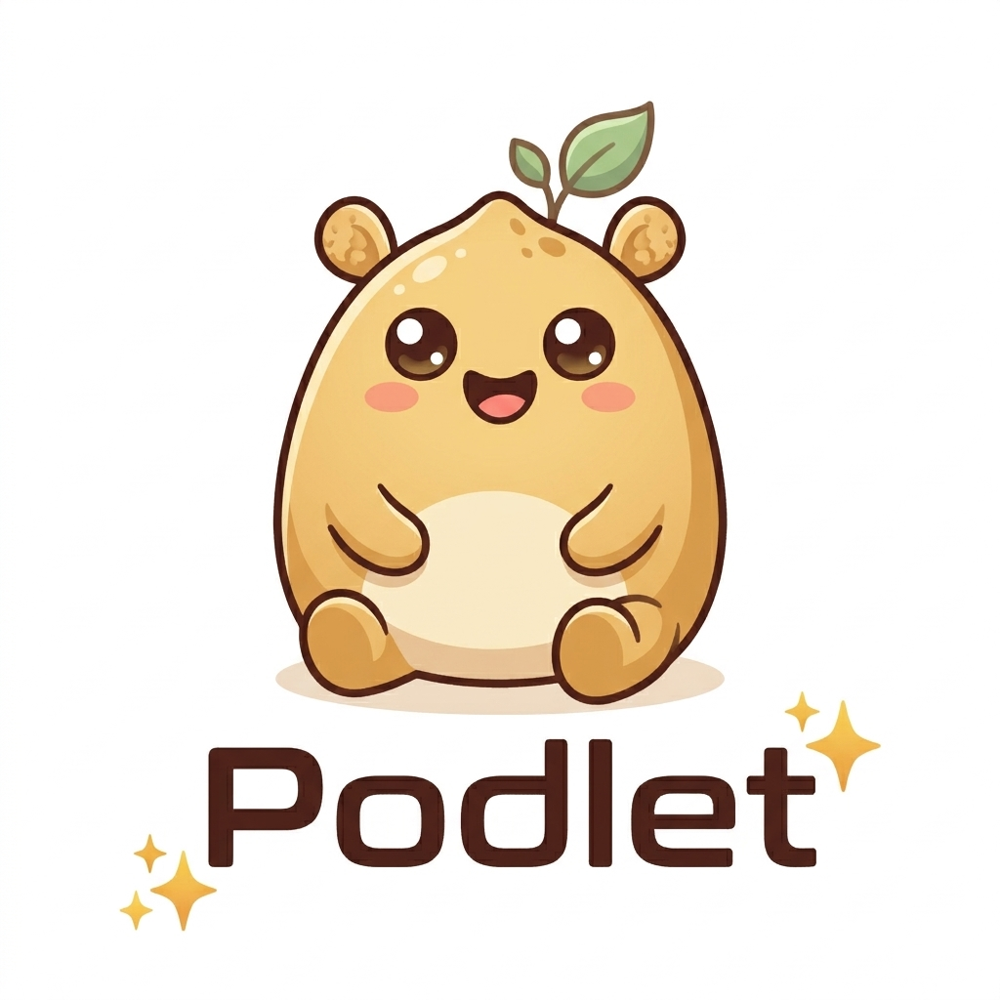

<p align="center">
  
</p>

# Podlet

*Modular AI Agent Orchestration System — a self-hosted app for orchestrating specialized agents.*


---

## Quick Start

*Two ways to run Podlet — pick one.*

### Docker (recommended)

**Prerequisites:** Docker and Docker Compose.

```bash
git clone https://github.com/HellKaiser45/Podlet.git
cd Podlet
./scripts/docker-compose.sh up -d
```

Add at least one provider key to `~/.podlet/.env` (create it — see [Configuration](#env)):

```
ANTHROPIC_API_KEY=sk-ant-...
```

Open **<http://localhost:3000>**. *(Docker serves the prebuilt frontend through the gateway/Elysia server — one process, one port.)*

### ⚡ From source

**Prerequisites:** [Bun](https://bun.sh) and Python 3.12.

```bash
git clone https://github.com/HellKaiser45/Podlet.git
cd Podlet
bun install
bun run init      # one-time setup (seeds ~/.podlet)
bun run start     # starts all three services
```

Add at least one provider key to `~/.podlet/.env` (see [Configuration](#env)):

```
ANTHROPIC_API_KEY=sk-ant-...
```

Open **<http://localhost:3002>**. *(Source mode runs a separate Vite dev server for the frontend, hence the different port from the gateway's 3000.)*

---

## Configuration

**How configuration gets there:** the repo ships a `.podlet/` seed folder — default `config.json`, `models.json`, `mcp.json`, agents, and skills. On the first `bun run init` (source) or the first Docker start, that seed folder is copied to `~/.podlet/`, which becomes the live config directory the running app reads from thereafter. Use `./scripts/docker-compose.sh` for Docker so the containers run with the same UID/GID as the user starting them.

You can customize either before or after that first copy:

- **Before:** edit the repo's `.podlet/` seed prior to your first init/build — your changes carry over in the copy.
- **After:** edit `~/.podlet/` directly at any time — this is what the running app reads.

**Where is my data?** Podlet's data lives in `~/.podlet` on the host, bind-mounted into the container at the same path (your `$HOME`). Nothing is stored inside the containers — config, agents, chat history, and generated files all survive rebuilds and resets.

> [!NOTE]
> **Docker user permissions:** the Compose helper exports your host UID/GID and creates `~/.podlet` before Docker mounts it. The gateway and agent-core then run as that same UID/GID, so files written to the bind mount belong to the user who started Podlet rather than root. Tool caches remain inside the container and are writable by the runtime UID.
>
> If you already have a root-owned `~/.podlet` from an older release, migrate it once with `sudo chown -R $(id -u):$(id -g) ~/.podlet`.

> [!NOTE]
> **Windows users:** the mount uses `$HOME/.podlet`. In a plain Windows `cmd` shell, `HOME` is often unset — export it (`set HOME=%USERPROFILE%`) before running `docker compose up`. In PowerShell, use `$env:HOME = $env:USERPROFILE` instead.

> [!CAUTION]
> The `.podlet` folder's location depends on your OS. Linux: `/home/<user>/.podlet`. macOS: `/Users/<user>/.podlet`. Windows: `C:\Users\<user>\.podlet`.
> The folder is hidden and needs to be shown in your file explorer.
> For the Docker port, don't change the ports in `config.json` — change the exposed port directly in `compose.yml` instead.

### `config.json`

<details>
<summary>Full default config (click to expand)</summary>

```json
{
  "server": {
    "port": 3000,
    "host": "127.0.0.1",
    "pythonPort": 8000,
    "webPort": 3002
  },
  "database": {
    "path": "podlet.db"
  },
  "features": {
    "safemode": false
  }
}
```

</details>

| Field | Type | Default | Effect |
|---|---|---|---|
| `server.port` | number | `3000` | Gateway API port. |
| `server.host` | string | `"127.0.0.1"` | Bind address. Docker forces `0.0.0.0`. |
| `server.pythonPort` | number | `8000` | Python backend port (native). |
| `server.webPort` | number | `3002` | Web UI port (native only). Also derives the CORS origin. |
| `database.path` | string | `"podlet.db"` | SQLite file name inside `~/.podlet`. |
| `features.safemode` | boolean | `false` | Human-in-the-Loop approval for destructive tool calls. |

**Port rules per mode:**

| Setting | Native | Docker |
|---|---|---|
| `server.port` | 🟢 adjustable | 🔴 keep at `3000` — the compose mapping targets it |
| `server.pythonPort` | 🟢 adjustable | 🔴 keep at `8000` — agent-core listens there |
| `server.webPort` | 🟢 adjustable | ⚪ no effect — the gateway serves the prebuilt bundle |
| `server.host` | 🟢 adjustable | 🔵 forced to `0.0.0.0` (handled automatically, not user-configurable) |

### Changing the exposed port

The compose file maps the gateway as `3000:3000`. To expose Podlet on a different port on the host, edit that line in `compose.yml` (for example `8080:3000`) and run `docker compose up -d` again.

> [!WARNING]
> Under Docker, changing `server.port` or `server.pythonPort` in `config.json` breaks the app silently — the compose mapping and the agent-core image depend on the fixed values. Use the compose port line to change the exposed port instead.

---

### `.env`

API keys live in `~/.podlet/.env`, one per provider (`OPENAI_API_KEY=...`, `ANTHROPIC_API_KEY=...`, ...). The Python core reads this file on every request — edits apply without restarting. Create this file yourself if it doesn't exist yet (e.g. `touch ~/.podlet/.env`); it is no longer generated on first run.

### `models.json`

Maps the model ids used by agents to actual provider models:

```json
{
  "fast": { "provider": "openrouter", "model": "zai/glm-4.6", "api_key_name": "OPENROUTER_API_KEY" },
  "smart": { "provider": "anthropic", "model": "claude-sonnet-4-20250514", "api_key_name": "ANTHROPIC_API_KEY" }
}
```

The `api_key_name` field is only necessary if the provider is a "small, recent, or niche" provider not officially supported by [litellm](https://docs.litellm.ai/docs/providers), or if you want a custom `api_key_name`.

Agent files reference these entries by key (`"model": "smart"`) — see [Agent Configuration](#agent-configuration) below.

#### OpenCode Go and app identity headers

Podlet sends a stable `User-Agent: podlet/1.0` on outbound LLM requests. For OpenCode Go endpoints it also sends `x-opencode-session` using the conversation/thread id, so every turn in one conversation reuses the same routing and prompt-cache identity.

To use OpenCode Go, set `OPENCODE_API_KEY` in `~/.podlet/.env` and point an agent at the `opencode` entry in `models.json`. The seed uses `glm-5.1`, currently documented by OpenCode Go as an OpenAI-compatible chat-completions model.

For OpenRouter models, Podlet automatically sends both app-attribution headers: `HTTP-Referer: https://github.com/HellKaiser45/Podlet` and `X-OpenRouter-Title: Podlet`. The legacy `X-Title` alias is also sent. To use a different identity — including a localhost URL — set `OPENROUTER_APP_REFERER` and `OPENROUTER_APP_TITLE` in `~/.podlet/.env`.

### `mcp.json`

Declares MCP servers; the default set ships `context7` (documentation lookups) and `ddg-search` (web search).

---

## Agent Configuration

Agents are JSON files in `~/.podlet/agents/`, loaded at gateway start.

<details>
<summary>Example agent file (click to expand)</summary>

```json
{
  "agentId": "backend-architect",
  "agentDescription": "Designs API contracts, data models, and service boundaries.",
  "model": "smart",
  "system_prompt": "backend_architect.md",
  "mcps": ["context7"],
  "skills": ["api-and-interface-design"],
  "subAgents": ["frontend-architect", "database-designer"]
}
```

</details>

> [!IMPORTANT]
> **Agent ids are identifiers, not labels.** Allowed: letters (any case), digits, `-` and `_`, 1–58 characters. The id becomes the delegation tool name (`agent_<id>`), so spaces break tool calls — and invalid ids are rejected at load with a warning in the gateway logs.

- **`model`** — a key from `models.json` (e.g. `"smart"`, `"fast"`), not a raw provider model id.
- **`system_prompt`** — the filename of a Markdown file (one prompt per file) in `~/.podlet/prompts/`. `"backend_architect.md"` resolves to `~/.podlet/prompts/backend_architect.md`.
- **`mcps`** — follows the same convention as Claude Code: a list of server names declared in `mcp.json` that this agent should have access to. Leave empty for no MCP access.
- **`subAgents`** — a list of `agentId`s this agent may delegate to. Each id becomes an `agent_<id>` tool callable from within that agent's context, subject to the same naming rule as top-level agents.

---

## Skills

Skills are instruction sets in `~/.podlet/skills/`, seeded on first run from the bundled `.podlet/skills/` set. A file watcher reloads them automatically — no restart needed.

For more information on skills, visit [the Claude docs](https://platform.claude.com/docs/en/agents-and-tools/agent-skills/best-practices).

---

## Human-in-the-Loop

With `features.safemode: true`, destructive tool calls (file deletion, shell commands) pause and request approval in the UI before executing. Approve or reject each request; nothing runs without you.

---

## Virtual File System

Every chat run gets two sandboxed directories under `~/.podlet/`:

| Directory | Purpose | Access |
|---|---|---|
| `workspace/<runId>/` | Your uploaded files | Read-only for agents |
| `artifacts/<runId>/` | Agent-generated output | Writable, per-agent subdirectories |

Agents cannot touch anything outside these roots or the skills folder.

---

## Tech Stack

| Layer | Stack |
|---|---|
| Gateway | Bun, Elysia, Drizzle ORM + SQLite, MCP TypeScript SDK, Zod |
| Agent Core | Python 3.12, FastAPI, litellm, uvicorn, python-dotenv |
| Frontend | SolidJS, Vite |

---

## Contributing

Follow the commit style: `feat:`, `fix:`, `docs:`, `refactor:`, `test:`, `chore:`. See [AGENTS.md](AGENTS.md) for architecture notes.

---

## License

MIT — see [LICENSE](LICENSE).
